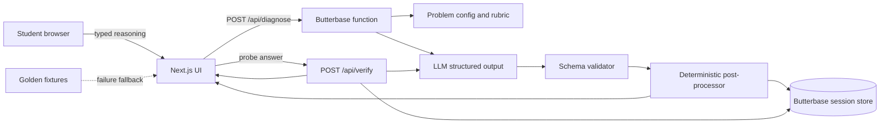

# Technical Architecture

## 1. Architecture objective

Build the shortest reliable path from typed reasoning to a verified diagnosis. The system should be modular enough to show a credible platform vision, but simple enough to deploy and debug in one day.

## 2. Recommended stack

### Frontend

- Next.js with TypeScript.
- Tailwind CSS or an existing component library.
- React Flow for the reasoning graph.
- Browser `SpeechRecognition` only as an optional enhancement.

### Backend

- Butterbase for required backend integration, persistence, serverless functions, deployment, and submission workflow.
- One server-side diagnostic function that calls the chosen LLM.
- JSON Schema validation using Zod or Ajv.

### AI provider

Use the sponsor-supported model endpoint that the team can configure fastest. The model must support reliable JSON output. Do not switch providers after the main flow works.

### Optional sponsor integration

EverMind can store a compact learner misconception summary across sessions. This is useful for the long-term vision but should not block the MVP. Nebius/Tavily are unnecessary for the core math diagnosis unless they are already configured.

## 3. System diagram



## 4. Component responsibilities

### Next.js UI

- manages four visual stages;
- collects learner inputs;
- renders graph and diagnosis;
- never parses free-form model prose;
- offers retry and fixture fallback;
- displays a visible partner integration indicator in the final state or footer.

### Problem configuration

A local or database-backed JSON object containing:

- prompt;
- learning objective;
- canonical reasoning steps;
- required assumptions;
- known misconception candidates;
- probe templates;
- intervention content or guidance;
- transfer problem.

The configuration constrains the model and makes the result more reliable than asking it to diagnose an arbitrary prompt from scratch.

### Diagnostic function

- validates request;
- retrieves problem config;
- sends a structured prompt;
- validates model response;
- normalizes node IDs and ordering;
- enforces exactly one first divergence;
- stores the result;
- returns render-ready JSON.

### Verification function

- receives original diagnosis and probe answer;
- evaluates whether evidence confirms or falsifies the hypothesis;
- returns updated status and intervention;
- stores the update.

### Butterbase persistence

Store at minimum:

- session ID;
- problem ID;
- learner response;
- diagnostic JSON;
- probe response;
- updated diagnosis;
- timestamps.

Authentication is optional for the demo. Use anonymous session IDs.

## 5. Request flow

### Initial diagnosis

1. UI posts problem ID and learner response.
2. Backend loads the problem rubric.
3. LLM decomposes the response and compares it with the rubric.
4. Backend validates the JSON.
5. Post-processor enforces invariants.
6. Session and diagnosis are persisted.
7. UI renders the graph, hypothesis, and probe.

### Probe verification

1. UI posts session ID and learner probe answer.
2. Backend loads the original diagnosis.
3. LLM evaluates the answer against explicit confirm/falsify criteria.
4. Backend validates and persists the updated state.
5. UI shows the changed diagnosis and intervention.

## 6. Deterministic safeguards

- Reject output containing zero reasoning nodes.
- Limit to six nodes for the demo.
- Require node IDs to be sequential and unique.
- Require one and only one `first_divergence` state when a misconception is present.
- Require evidence to reference existing node IDs.
- Limit hypothesis and probe length.
- If output fails validation, retry once with the validation errors.
- If the retry fails, load the golden fixture and visibly label the session “Demo recovery mode” only in developer/debug UI.

## 7. Repository structure

```text
cortex/
├── app/
│   ├── page.tsx
│   ├── api/diagnose/route.ts
│   └── api/verify/route.ts
├── components/
│   ├── ProblemCard.tsx
│   ├── ReasoningInput.tsx
│   ├── ReasoningGraph.tsx
│   ├── DiagnosisCard.tsx
│   ├── ProbeCard.tsx
│   └── InterventionCard.tsx
├── lib/
│   ├── butterbase.ts
│   ├── llm.ts
│   ├── prompts.ts
│   ├── schemas.ts
│   ├── postprocess.ts
│   └── fixtures.ts
├── data/problems/
│   └── average-vs-instantaneous-speed.json
└── public/
    └── cortex-brand-assets/
```

If Butterbase generates or hosts backend functions differently, keep the same logical separation even if physical paths change.

## 8. Deployment plan

1. Create the Butterbase app and connect MCP before feature work.
2. Confirm one test record can be written and read.
3. Deploy a basic frontend shell early.
4. Add environment variables for the model endpoint.
5. Keep a local fixture mode controlled by an environment flag.
6. Test the public deployment before polishing animation.
7. Complete the Butterbase submission process before the final demo window.

## 9. Observability

For the hackathon, log:

- request ID and session ID;
- model latency;
- validation success/failure;
- fallback use;
- total diagnostic latency;
- stage-specific errors.

Do not log secret keys. Avoid storing unnecessary learner identifiers.

## 10. Performance budget

| Operation | Target |
|---|---:|
| UI submit feedback | under 200 ms |
| Initial AI diagnosis | under 8 s |
| Graph rendering | under 500 ms after response |
| Probe verification | under 8 s |
| Full demo loop | under 2 min |

## 11. Why not a real-time recording architecture

Continuous screen or audio capture introduces permissions, privacy, transcription, event processing, storage, and latency concerns. It also shifts the story toward surveillance or proctoring. Typed reasoning gives Cortex clean evidence and keeps the demonstration centered on learning diagnosis.
