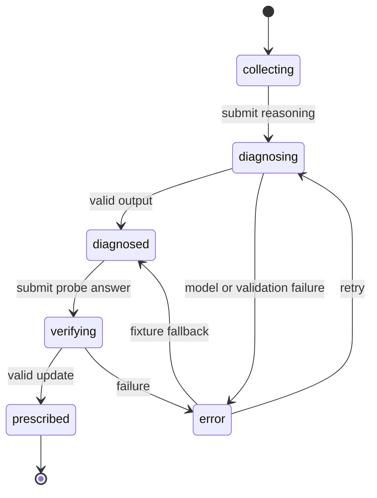

# Data Model and API Contracts

## 1. Design principles

- Keep the database small and session-centered.
- Store model output as structured JSON for speed, while keeping key fields queryable.
- Use anonymous session IDs for the demo.
- Version the problem configuration and prompt.
- Treat AI output as an artifact with provenance, not ground truth.

## 2. Core entities

### `problems`

| Field | Type | Notes |
|---|---|---|
| `id` | string | e.g. `avg-instant-speed-v1` |
| `title` | string | Human-readable title |
| `prompt` | text | Learner-facing problem |
| `concept` | string | Target concept |
| `config_json` | json | Rubric, misconceptions, interventions |
| `version` | integer | Increment on material change |

### `diagnostic_sessions`

| Field | Type | Notes |
|---|---|---|
| `id` | string/uuid | Public session identifier |
| `problem_id` | string | Foreign key |
| `learner_response` | text | Answer and reasoning |
| `stage` | enum | diagnosed, probed, prescribed |
| `created_at` | timestamp | Server timestamp |
| `updated_at` | timestamp | Server timestamp |

### `diagnoses`

| Field | Type | Notes |
|---|---|---|
| `id` | string/uuid | Diagnosis artifact |
| `session_id` | string | Foreign key |
| `output_json` | json | Full validated diagnosis |
| `hypothesis_id` | string | Known or generated code |
| `hypothesis_text` | text | Queryable summary |
| `confidence` | number | 0–1 model confidence cue |
| `first_divergence_node_id` | string | Evidence pointer |
| `prompt_version` | string | Reproducibility |
| `model_name` | string | Reproducibility |
| `latency_ms` | integer | Debugging |
| `used_fallback` | boolean | Demo monitoring |

### `probe_responses`

| Field | Type | Notes |
|---|---|---|
| `id` | string/uuid | Probe response |
| `session_id` | string | Foreign key |
| `probe_text` | text | Question asked |
| `response_text` | text | Learner answer |
| `updated_status` | enum | confirmed/weakened/rejected/replaced |
| `updated_output_json` | json | Verification and intervention |
| `created_at` | timestamp | Server timestamp |

For the fastest build, these can be reduced to a single `diagnostic_sessions` collection with nested JSON. The normalized model above is the preferred direction, not a requirement for the first demo.

## 3. State machine



## 4. API: create diagnosis

### `POST /api/diagnose`

Request:

```json
{
  "problem_id": "avg-instant-speed-v1",
  "learner_response": "The car traveled 120 miles in two hours, so its speed was 60 mph. Therefore, after one hour, it was moving at 60 mph."
}
```

Response:

```json
{
  "session_id": "sess_123",
  "stage": "diagnosed",
  "reasoning_nodes": [],
  "reasoning_edges": [],
  "first_divergence_node_id": "n3",
  "hypothesis": {},
  "probe": {},
  "meta": {
    "latency_ms": 4200,
    "model": "configured-model",
    "used_fallback": false
  }
}
```

Errors:

- `400`: invalid problem or response too short;
- `422`: model output could not be validated;
- `429`: provider rate limit;
- `500`: unexpected backend error.

The UI should convert all server errors to one friendly retry state.

## 5. API: verify diagnosis

### `POST /api/verify`

Request:

```json
{
  "session_id": "sess_123",
  "probe_response": "Yes, the two-hour average would still be 60 mph, but its speed after one hour would not have to be 60 mph."
}
```

Response:

```json
{
  "session_id": "sess_123",
  "stage": "prescribed",
  "diagnosis_update": {
    "status": "confirmed",
    "summary": "The response distinguishes the interval average from the speed at a specific moment.",
    "confidence": 0.91
  },
  "intervention": {
    "title": "Average versus instantaneous speed",
    "explanation": "...",
    "visual": {"type": "two_scenario_timeline", "data": {}},
    "transfer_problem": "...",
    "success_criterion": "..."
  }
}
```

## 6. Render contract

The frontend should receive render-ready data. It should not infer graph states from raw text.

Reasoning node:

```ts
export type ReasoningNode = {
  id: string;
  sequence: number;
  type: "claim" | "operation" | "assumption" | "conclusion";
  text: string;
  evidence_excerpt: string;
  depends_on: string[];
  status: "supported" | "uncertain" | "first_divergence" | "downstream";
  explanation: string;
};
```

Hypothesis:

```ts
export type Hypothesis = {
  id: string;
  label: string;
  statement: string;
  confidence: number;
  evidence_node_ids: string[];
  alternatives: string[];
};
```

Probe:

```ts
export type Probe = {
  question: string;
  purpose: string;
  confirms_when: string[];
  weakens_when: string[];
};
```

## 7. Validation invariants

Before saving or rendering:

- `reasoning_nodes.length` is 2–6;
- node sequence values are unique;
- every dependency points to an earlier node;
- every edge references existing nodes;
- exactly one node has status `first_divergence` when a hypothesis exists;
- hypothesis evidence references existing nodes;
- confidence is between 0 and 1;
- probe question is under 280 characters;
- explanation is under 100 words;
- transfer problem does not include its answer.

## 8. Privacy defaults

- Use anonymous IDs.
- Do not request a real name, email, age, school, or disability information.
- Add a delete/reset action that clears local state.
- Keep raw text only for the demo session unless persistence is needed to show Butterbase.
- Do not label model output as a psychological or clinical assessment.
